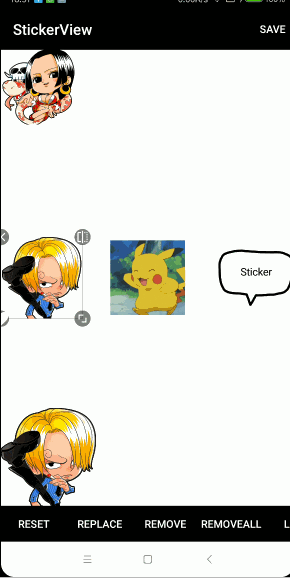

## 说明
对其[ wuapnjie/StickerView ](https://github.com/wuapnjie/StickerView)进行了扩展

### 增加的特性
1. 支持`ViewSticker`，但不能与其它Sticker共用
2. 支持`Gravity`，不再需要`Sticker.Position`

## 截图


## Gradle
```
implementation 'com.dyhdyh.support:sticker:1.6.17-view'
```

## 以View作为贴纸
#### 在Java中添加ViewSticker
```
ImageView imageView = new ImageView(this);
final StickerView.LayoutParams layoutParams = new StickerView.LayoutParams(300, 300);
layoutParams.gravity = Gravity.LEFT;//靠左
imageView.setLayoutParams(layoutParams);
stickerView.addView(imageView);
```

#### 初始化缩放
```
<!--初始化时的缩放-->
<attr name="initialScale" format="float" />
<!--初始化时的缩放 以宽度还是以高度为基准-->
<attr name="initialScaleBaseline" format="enum" >
    <enum name="self" value="0"/>
    <enum name="parent_width" value="1"/>
    <enum name="parent_height" value="2"/>
</attr>
```