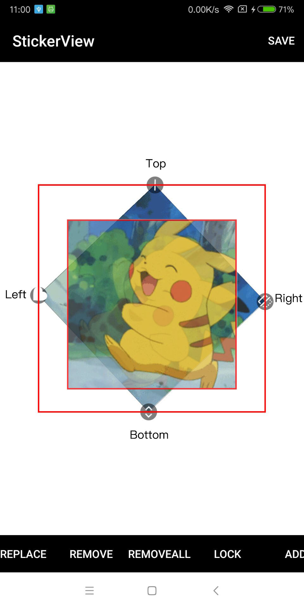

`setScaleX`、`setX`、`setRotation`都不会真实的改变View的轮廓，所以在`onLayout`中指定它的位置和大小。

如图旋转会扩大View的轮廓，如果完全通过`mappedBound`设置会导致View也变大，所以`layout`的值需要重新计算，`Right-Left`就是旋转后的的宽度，再减去宽度得出超出的2个三角形高度，除个2得出一边的超出部分，这样才能保证layout的值是正确的

```
@Override
protected void onLayout(boolean changed, int left, int top, int right, int bottom) {
    super.onLayout(changed, left, top, right, bottom);
    
    for (Sticker sticker : stickers) {
        if (sticker instanceof ViewSticker) {
            final float rotation = sticker.getCurrentAngle();
            final RectF mappedBound = sticker.getMappedBound();
            final float scaleWidth = sticker.getCurrentWidth();
            final float scaleHeight = sticker.getCurrentHeight();
            //(旋转后的宽高-缩放后的宽高)的一半就是偏移量
            int offsetX = (int) (mappedBound.right - mappedBound.left - scaleWidth) / 2;
            int offsetY = (int) (mappedBound.bottom - mappedBound.top - scaleHeight) / 2;

            int newLeft = (int) mappedBound.left + offsetX;
            int newTop = (int) mappedBound.top + offsetY;
            int newRight = (int) (newLeft + scaleWidth);
            int newBottom = (int) (newTop + scaleHeight);
            ((ViewSticker) sticker).getView().setRotation(rotation);
            ((ViewSticker) sticker).getView().layout(newLeft, newTop, newRight, newBottom);
        }
    }
}
```